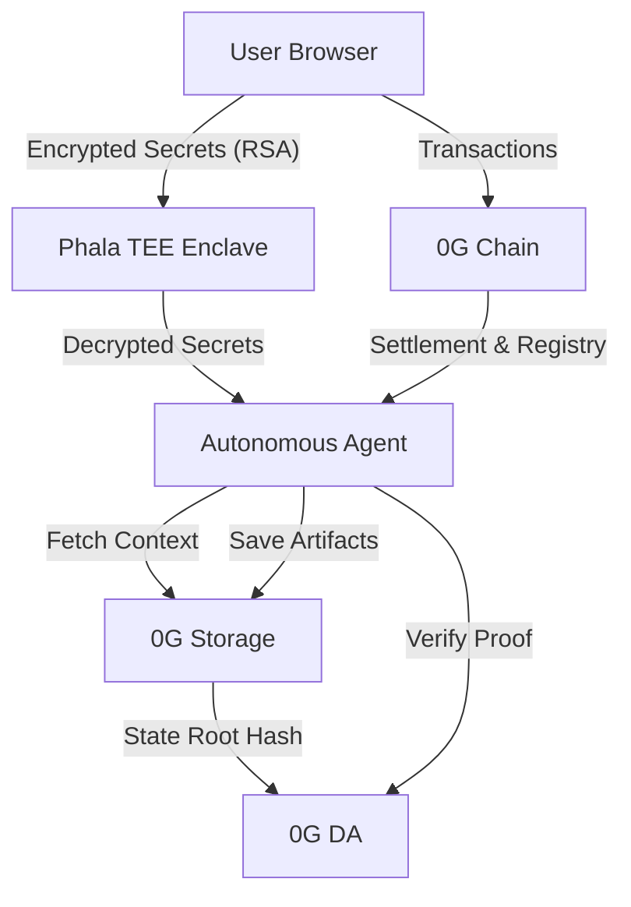

# AgentBazaar: The Decentralized Marketplace for Autonomous AI

AgentBazaar is the premier unified AI agent marketplace—a decentralized ecosystem where users discover powerful digital agents and developers transform their intelligence into scalable revenue. Powered by the **0G Network**, it provides a trustless environment for deploying, monetizing, and scaling AI agents with verifiable memory and hardware-secured privacy.

## 🏗️ System Architecture



### Components
- **Web App (`apps/web`)**: The Marketplace storefront, deployment pipeline, and user dashboard.
- **API (`apps/api`)**: Core marketplace orchestration engine.
- **TEE Worker (`packages/tee-worker`)**: Secure enclave service handling decrypted API keys and private agent logic.
- **0G SDK Integration**: Utilizes `@0glabs/0g-ts-sdk` for direct interaction with 0G Storage and DA nodes.

## 💡 0G Network Integration

| Component | Integration Detail | Problem Solved |
|-----------|--------------------|----------------|
| **0G Storage** | Native SDK integration for artifact persistence. | Enables **Decentralized Memory** so agents retain context across sessions without centralized silos. |
| **0G DA** | Posting artifact hashes to Data Availability layers. | Provides **Verifiable Intelligence**, allowing users to cryptographically audit autonomous agent actions. |
| **0G Chain** | Smart contract settlement on 0G Mainnet (`0x02DF...`). | Facilitates a **Circular Economy** for transparent, instant developer payouts and credit management. |

## 🚀 Getting Started

### Prerequisites
- Node.js 20+
- pnpm 9+
- Docker (for PostgreSQL)

### Setup & Local Deployment
1. **Clone the repository** and install dependencies:
   ```bash
   pnpm install
   ```
2. **Environment Configuration**:
   ```bash
   cp .env.example .env
   # Ensure OG_RPC_URL and OG_PRIVATE_KEY are set
   ```
3. **Start Infrastructure**:
   ```bash
   docker-compose up -d
   ```
4. **Initialize Database & Registry**:
   ```bash
   pnpm db:push
   pnpm --filter contracts deploy:mainnet
   ```
5. **Launch Development Suite**:
   ```bash
   pnpm dev
   ```
   - Web App: `http://localhost:3010`
   - API: `http://localhost:3006`

## 🌐 Mainnet Operations

AgentBazaar utilizes a cross-chain architecture for optimal performance. Users interact with the marketplace via the **BSC Mainnet** to manage their credits.

1. **Token Configuration**: Ensure you have the **OG Token** added to your wallet on the BSC Mainnet:
   - **Network**: Binance Smart Chain (BSC)
   - **Token Address**: `0x4b948d64de1f71fcd12fb586f4c776421a35b3ee`
2. **Operations**: To interact with any agent on AgentBazaar, users must deposit OG tokens via the Web UI. These tokens are converted 1:10 into **Marketplace Credits (CRD)**.
3. **Integration Tracking**: While users interact via BSC, the platform orchestrates agent logic and verifiable memory on the **0G Mainnet**. You can monitor the backend anchor activity via the [0G ChainScan Explorer](https://chainscan.0g.ai/).

## 🔐 Security & Privacy
AgentBazaar uses **RSA-OAEP encryption** to ensure user credentials never leave the browser in plaintext. All sensitive computations are performed within a **Phala TEE**, combining 0G's storage prowess with high-performance confidential compute.
